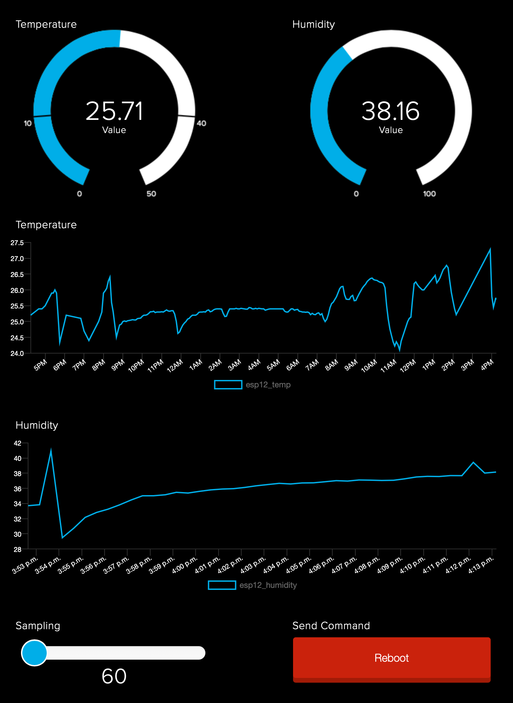

# esp-sensor

## MQTT Temperature, Atmospheric Pressure, and Humidity sensor

The hardware used for that project:
  - ESP8266 Micro-Controller
  - BMP280 Atmospheric sensor
  - OLED ssd1306 mini display

The display and the sensor are using an I2C bus. The only thing I had to do is plug the sensors into the power and on the two wires of the I2C bus.

## Installation

This project has been developed using the programming language Python, or to be exact, micropython. For more information on micropython and how to flash micropython on your ESP8266. You can refer to the web site for this project at https://micropython.org/.

Once the microcontroller is running micropython, you can install the esp-sensor's files.

Edit and enter your credentials into the file `wificonfig.sample` and save it into `wificonfig.py`.

### Install the library into the ESP8266

```
ampy -d 1 --port /dev/cu.wchusbserial110 -b 115200 mkdir lib
ampy -d 1 --port /dev/cu.wchusbserial110 -b 115200 put lib/bme280.py lib/bme280.py
```

### Install the rest of the files

```
ampy -d 1 --port /dev/cu.wchusbserial110 -b 115200 put wificonfig.py
ampy -d 1 --port /dev/cu.wchusbserial110 -b 115200 put espsensor.py
ampy -d 1 --port /dev/cu.wchusbserial110 -b 115200 put main.py
ampy -d 1 --port /dev/cu.wchusbserial110 -b 115200 put boot.py
```

## Running

After all the files are uploaded to your microcontroller, you can plug the power. The OLED display will blink once, print a WiFi connection message, then display the sensor's values.

You can use the Serial console on your Arduino software, or any console software available on the Internet. On my Mac, I use the open-source program called `screen`.

After starting the microcontroller, check if you have any errors. Critical, Error, Warning, and informational messages should appear on the console.

#### This is what you should see if everything is working fine

```
INFO:ESP32:ESPSensor starting
INFO:ESP32:Connecting to network...
INFO:ESP32:Could not connect to the WiFi network
INFO:ESP32:Button pressed: W6BSD/feeds/esp12_btn 0
```

#### Error example

In the following example, the console displays a typical error when the device cannot connect to the WiFi. The controller will try ten times to connect on the WiFi router. If all attempts fail, the controller waits for 10 minutes, then reboot.

```
INFO:ESP32:ESPSensor starting
INFO:ESP32:Connecting to network...
INFO:ESP32:Could not connect to the WiFi network

MicroPython v1.13 on 2020-09-11; ESP module with ESP8266
Type "help()" for more information.
>>>
resets Jan  8 2013,rst cause:2, boot mode:(3,7)

load 0x40100000, len 30768, room 16
tail 0
chksum 0xc4
load 0x3ffe8000, len 1024, room 8
tail 8
chksum 0xd8
load 0x3ffe8400, len 1080, room 0
tail 8
chksum 0xc4
csum 0xc4

INFO:ESP32:ESPSensor starting
INFO:ESP32:Connecting to network...
INFO:ESP32:Could not connect to the WiFi network
```

## Picture of the development prototype


## Dashboard

The image below is an example of a dashboard that I have built on Adafruit using all the sensor's data. You will notice the slider allowing me to change the sampling rate and the reset button for remotely resetting the device.



## Misc

Links for more information on the tools I am using:

  - https://www.gnu.org/software/screen/screen.html
  - https://micropython.org
  - https://docs.wemos.cc/en/latest/d1/d1_mini.html
  - https://ae-bst.resource.bosch.com/media/_tech/media/product_flyer/BST-BME280-FL000.pdf
  - https://github.com/triplepoint/micropython_bme280_i2c

The live dashboard on adafruit.io:

  - https://io.adafruit.com/W6BSD/dashboards/esp12

More info on that project:

  - https://0x9900.com/esp8266-environment-sensor/
